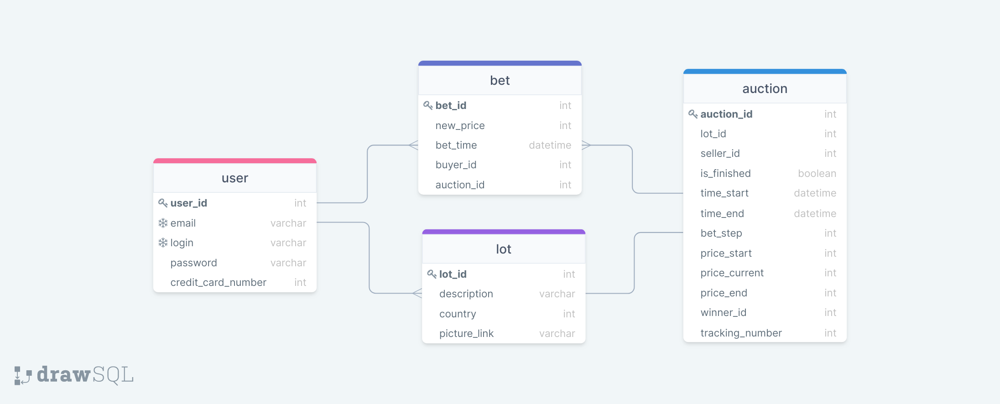

# Курс "Базы данных"

## Задание 1. Волохов Никита Алексеевич, БПИ197

Вам поручено разработать онлайн-аукцион. Он позволяет продавцам продавать свои товары с помощью аукциона. Покупатели делают ставки. Выигрывает последняя самая высокая ставка. После закрытия аукциона победитель оплачивает товар с помощью кредитной карты. Продавец отвечает за доставку товара покупателю.

### **_Предложите список функциональных требований для проекта._**
1. Возможность публиковать объявление для аукциона:
    1. Указание цены объявления;
    2. Указание описания объявления;
    3. Указание населенного пункта, из которого осуществляется доставка;
    4. Указание времени окончания аукциона (аукцион проходит не более двух недель);
2. Возможность вносить ставку для объявления;
3. Возможность установить шаг ставки;
4. После окончания аукциона последняя ставка побеждает;
5. После окончания аукциона победитель обязан оплатить стоимость выигранного лота и стоимость доставки онлайн. Если победитель не оплачивает лот в течении 3-х дней после момента победы, аукцион аннулируется;
6. После оплаты победителем стоимости лота, покупатель обязан отправить лот в течении 3 дней после прохождения транзакции и добавить трекниг-номер в сайт аукциона.
7. Состояние посылки отображается на сайте благодаря трекинг-номеру.
8. После получения покупателем лота, сервис онлайн-аукциона запрашивает номер кредитной карты у продавца и переводит ему деньги за лот.

### **_Определите роли пользователей и действия для каждой роли._**
1. Продавец:
    1. Указывает информацию об объявлении: цену, описание, местонахождение отправления, время окончания аукциона;
    2. Указывает трекинг-номер для отправленного лота;
    3. Указывает номер кредитной карты для получения средств за проданный лот.
2. Покупатель:
    1. Вносит ставки для лота;
    2. Указывает номер кредитной карты для оплаты выигранного лота;
    3. Отслеживает на сайте местонахождение выигранного лота.

### **_Определите объекты, о которых будут храниться данные._**
1. Пользователь:
	1. id пользователя;
	2. email;
	3. login;
	4. password.
	5. Номер кредитной карты.
2. Ставка:
	1. id ставки;
	2. Сумма ставки;
	3. Время ставки;
	4. id покупателя;
	5. id аукциона
3. Лот:
	1. id лота;
	2. Описание лота;
	3. Страна, в которой находится лот;
	4. Ссылка на фотографию лота;
4. Аукнион:
	1. id аукциона;
	2. id лота;
	3. id продавца;
	4. Завершен ли аукцион;
	5. Время начала аукциона;
	6. Вресмя завершения аукциона;
	7. Шаг ставки;
	8. Начальная стоимость лота;
	9. Текущая стоимость лота;
	10. Победная (последняя) стоимость лота;
	11. id победителя;
	12. Трекинг номер посылки с выигранным лотом

### **_Определите связи между объектами для хранения данных._**
1. Пользователь - ставка (1-to-many);
2. Пользователь - лот (1-to-many);
3. Ставка - аукцион (many-to-1);
4. Лот - аукцион (1-to-1).

### **_Нарисуйте схему объектной модели (используя любые обозначения, которые вам удобны)._**

