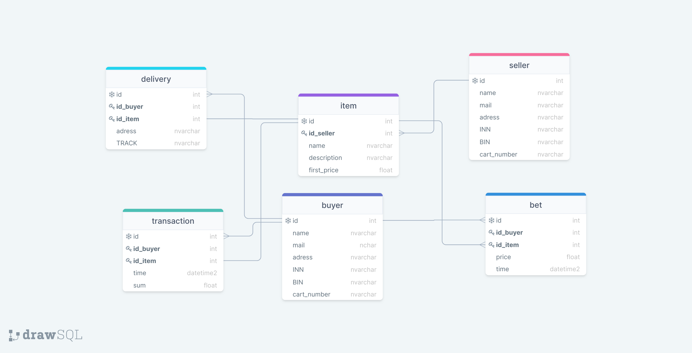

## Функциональные требования
1. Отслеживать статистику по ставкам (интенсивность, рост и тд. - любые метрики)
2. Статика по товарам (что и как продается)
3. В целом можно проводить аналитику по всем метрикам
4. Отслеживать транзакции (относительная прозрачность)
5. Доставка - что, куда, в каком статусе и тд.
6. Получать базовую информации по покупателям - сколько товаров купил, в каких торгах участвует и тд.
7. Получать базовую информации по продавцам - какие товары продает, сколько сделок закрыл и тд.
8. Возможность изменять платежные даные покупателя/продавца
9. Возможность отслеживать отслеживать ставки на торгах в режиме online

## Роли
1. Покупатель
	1. Изменить платежные данные
	2. Сделать ставку на товар
	3. Открыть транзакцию
	4. Получить информацию о доставке
2. Продавец
	1. Добавить/удалить товар
	2. Принять транзакцию

## Хранимые объекты
1. Продавец
2. Покупатель
3. Товар
3. Ставка
4. Транзакция
5. Доставка

## Связи
1. Продавец - товар (один ко многим)
2. Покупатель - товар (многие ко многим) через объект "ставка"
3. Товар - транзакиця (один к одному)
4. Покупатель - транзакция (один ко многим)
5. Покупатель - доставка (один ко многим)

## Диаграмма

