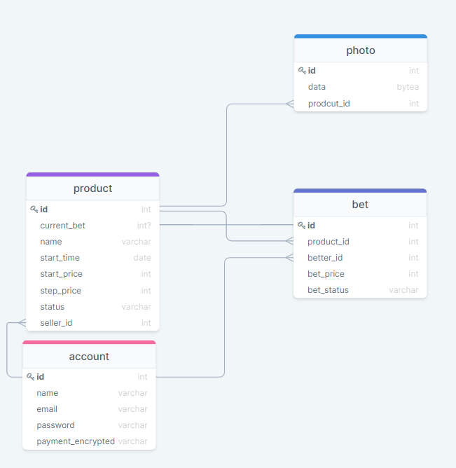

# Задание 1, Корнилов Георгий

Вам поручено разработать онлайн-аукцион. Он позволяет продавцам продавать свои товары с помощью аукциона. Покупатели делают ставки. Выигрывает последняя самая высокая ставка. После закрытия аукциона победитель оплачивает товар с помощью кредитной карты. Продавец отвечает за доставку товара покупателю.

## Функциональные требования

### Аккаунт
1. Создание аккаунта со следующими полями:
    - Имя
    - Номер телефона
    - Адрес элект   ронной почты
    - Пароль (хранится в захэшированном виде)
    - Платежные данные пользователя (хранятся в зашифрованном виде)
2. Редактирование профиля пользователя по следующим параметрам: имя, адрес электронной почты, пароль, платежные данные.

### Лоты
1. Просмотр текущих открытых лотов.
2. Поиск открытых и закрытых лотов по названию лота.
3. Просмотр информации о лоте:
    - Название лота
    - Фотографии товара
    - Время начала продажи лота
    - Сумма начальной ставки
    - Текущая ставка (или null, если ставки нет)
    - Шаг ставки

### Продавец
1. Создание лота с параметрами, указанными выше.
2. Возможность просмотра всех активных, законченных лотов продавца.

### Покупатель
1. Возможность сделать ставку на любой открытый лот.
При ставке временно снимается часть средств пользователя в размере ставки пользователя.
Данные средства возвращаются после окончания "разыгрывания " лота.
2. Получение уведомления, если текущая ставка покупателя была перебита.
3. Возможность указать адрес доставки, если ставка пользователя выиграла. 
4. Возиожность просмотра всех лотов, в разыгрывании которых участвовал/учатсвует пользователь.

## Роли пользователей.
Пользователь может быть как продавцом, так и покупателем. Действия пользователей в рамках кокретного лота
соответствуют их ролям в рамках данного лота(возможные действия пользователя и продавца описаны ранее). 

## Объекты, хранимые в базе данных.
### Аккаунт
- Имя
- Номер телефона
- Адрес элекронной почты
- Пароль (хранится в захэшированном виде)
- Платежные данные пользователя (хранятся в зашифрованном виде)

### Лот
- Название лота
- Фотографии товара
- Аккаунт продавца
- Время начала продажи лота
- Сумма начальной ставки
- Текущая ставка (или null, если ставки нет)
- Статус лота (выкуплен, идут торги, торги не начались, не продано) 
- Шаг ставки

### Ставка
- Пользователь, сделавший ставку
- Лот, на который бал сделана ставка
- Сумма ставки
- Статус ставки (выигрывает на данный момент/была перебита/выиграла)

### Фотография 
- "raw data" фотографии

## Связи между объектами
1. У каждого аккаунта есть список активных продаваемых лотов - связь один ко многим.
2. У каждого аккаунта есть список активных завершеных лотов - связь один ко многим.
3. У каждого пользователя есть список сделанных им ставок - связь один ко многим.
4. У каждого лота есть активная ставка - всязь один к одному.
5. У каждого лота есть список ставок - связь один ко многим.
6. У каждого лота есть список фотографий - связь один ко многим. 

## Схема связей объектов
