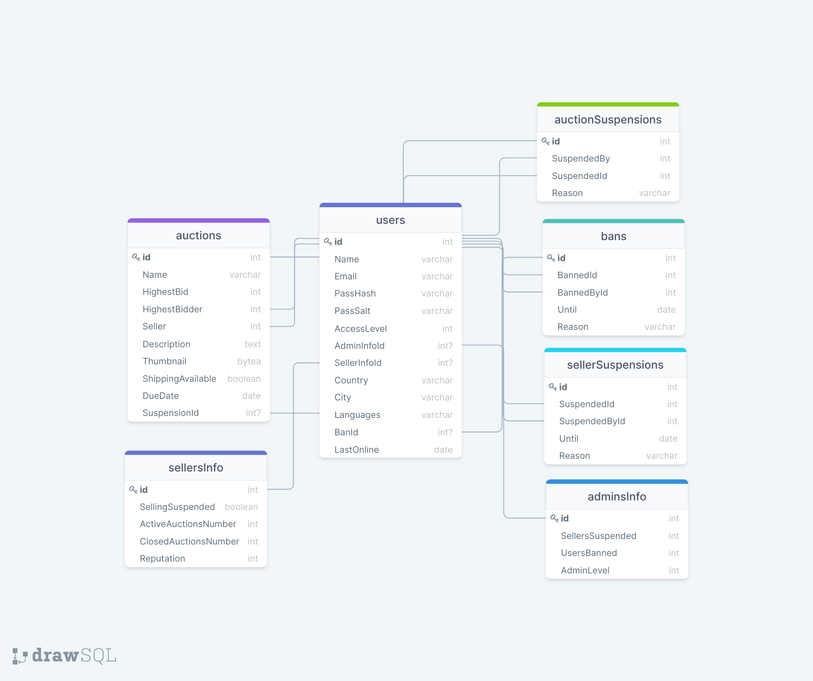

# Задание 1
## Скрыпников Егор, БПИ192
### Общее описание проекта
Цель -- создать описание реализации базы данных платформы онлайн-аукциона, в некотором смысле являющегося клоном площадки eBay.

Приложение, разумеется, является клинет-серверным. Оно может иметь несколько фронтэндов (веб-сайт, мобильное приложение и т.д), но при этом имеет только один бэкэнд, предоставляющий фронтэндам некоторое webAPI для ограниченного взаимодействия с данными.

### Функциональные требования
Итак, на мой взгляд следующие функциональные требования, связанные с данными, имеют смысл:

* Платформа должна запоминать зарегестрированных на площадке пользователей и предоставлять несколько уровней привелегий пользователей (рядовой -- продавец -- администратор).
* Платформа должна предоставлять пользователям некоторый личный кабинет для менеджмента личных данных в каждом интерфейсе приложения.
* Платформа должена иметь возможность показывать пользователю только часть личных данных другого пользователя.
* Платформа должна поддерживать торги: давать возможность делать ставки и определять победителя аукциона.
* Платформа должна давать регистрировать аукционы.
* Платформа должна предоставлять механизм для организации доставки купленного товара через сторонние логисчиские компании.
* Плафтформа должна предоставлять достаточный уровень безопасности для чувствительной информации пользователей -- адреса, истории покупок и т.д.

### Роли пользователей и действия для каждой роли
Мне кажется разумным следующее разделение:

1. Рядовой пользователь
* Может делать ставки на аукционах и выигрывать их
* Может отслеживать оперделённые аукционы
* Может редактировать информацию о себе в своём личном кабинете
* Может просматривать историю своих покупок
2. Продавец, может всё то же, что рядовой пользователь, но ещё
* Может выставлять лоты на аукцион и снимать их через личный кабинет.
3. Администратор, может всё то же, что продавец, но ещё
* Ограничивать доступ других пользователей к площадке
* Закрывать открытые аукционы досрочно

### Объекты, в которых хранятся данные
1. users (пользователи)
* id: int
* Name: varchar
* Email: varchar
* PassHash: varchar
* PassSalt: varchar
* AccessLevel: int
* AdminInfoId: int?
* SellerInfoId: int?
* Country: varchar
* City: varchar
* Languages: varchar
* BanId: int?
* LastOnline: date
2. auctions (аукционы)
* id: int
* Name: varchar
* HighestBid: bigint
* HighestBidder: int
* Seller: int
* Description: text
* Thumbnail: bytea (это картинка)
* ShippingAvailable: boolean
* DueDate: date
* SuspensionId: int?
3. sellersInfo (информация о продавцах)
* id: int
* SellingSuspended: boolean
* ActiveAuctionsNumber: int
* ClosedAuctionsNumber: int
* Reputation: int
4. adminsInfo (информация об админах)
* id: int
* SellersSuspended: int
* UsersBanned: int
* AdminLevel: int
5. bans (баны)
* id: int
* BannedId: int
* BannedById: int
* Until: date
* Reason: varchar
6. sellerSuspensions
* id: int
* SuspendedId: int
* SuspendedById: int
* Until: date
* Reason: varchar
7. auctionSuspensions
* id: int
* SuspendedBy: int
* SuspendedId: int
* Reason: varchar

### Связи между объектами
Все связи -- один к одному, имеются между

* `auctions.HighestBidder` и `users.id`
* `auctions.Seller` и `users.id`
* `sellersInfo.id` и `users.SellerInfoId`
* `adminsInfo.id` и `users.AdminInfoId`
* `bans.BannedById` и `users.id`
* `bans.BannedId` и `users.id`
* `users.BanId` и `bans.id`
* `auctionSuspensions.id` и `auctions.SuspensionId`
* `auctionSuspensions.SuspendedBy` и `users.id`
* `auctionSuspensions.SuspendedId` и `auctions.id`
* `sellerSuspensions.SuspendedId` и `users.id`
* `sellerSuspensions.SuspendedById` и `users.id`

### Схема

 

