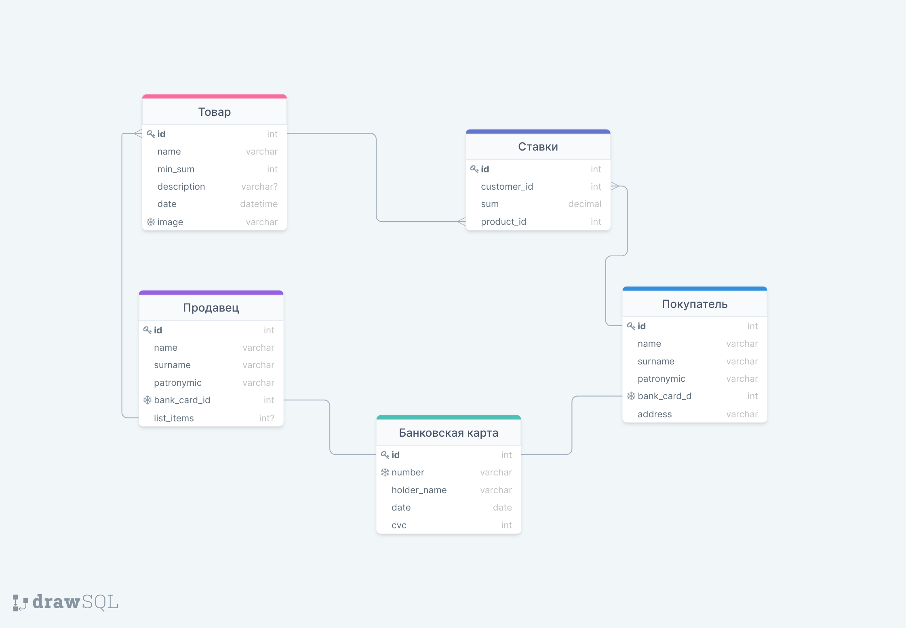

# Задание 1: Ткаченко Никита, БПИ197
 ## Функциональные требования

 ***1. Для покупателя:***
   * Создавать аккаунт покупателя
   * Авторизироваться
   * Привязывать банковскую карту к аккаунту
   * Просматривать возможные лоты
   * Находить лот по названию
   * Сортировать лоты по цене
   * Выбирать валюту ставок
   * Делать ставку в выбранной валюте
   * Повышать ставку
   * Отслеживать активные для покупателя лоты
   * Оплачивать банковской картой
   * Заказывать доставку

 ***2. Для продавца:***
   * Создавать аккаунт продавца
   * Авторизироваться
   * Привязывать банковскую карту к аккаунту
   * Публиковать новый лот
   * Указывать начальную цену товара
   * Указывать временные рамки продажи лота
   * Добавлять описание к лоту
   * Изменять информацию о лоте
   * Удалять лот
   * Выставлять товар повторно с другими временными рамками
   * Получать деньги за лот
   * Осуществлять доставку до покупателя 
 
 ***3. Для платформы онлайн-аукциона:***
   * Определять победителя лота
   * Хранить сессии активных аукционов
   * Выставлять требования к покупателям, продавцам и лотам
   * Верифицировать пользователей при регистрации
   * Сохранять историю аукциона
   * Отслеживать доставку товара 
   * Выступать 3-им лицом в денежных отношений между покупателем, выигравшим аукцион, и продавцом
   * Блокировать аукционы, нарушающие требования 
   * Осуществлять тех-поддержку пользователей

 ## Роли пользователей и действия для каждой роли

 ***1. Покупатель:***
   * Зарегистрироваться
   * Авторизоваться
   * Привязать банковскую карту к аккаунту
   * Получить лоты по названию
   * Получить список всех лотов
   * Сортировать лоты по цене
   * Выбрать валюту для ставки
   * Сделать ставку на товар
   * Повысить ставку на товар
   * Смотреть на активные лоты
   * Оплатить банковской картой 
   * Заказать доставку 
   * Указать адрес доставки
   * Просмотреть статус доставки 
   
 ***2. Продавец:***
   * Зарегистрироваться
   * Авторизоваться
   * Привязать банковскую карту к аккаунту
   * Опубликовать новый лот
   * Указать начальную цену, временные рамки и информацию по лоту
   * Изменить информацию по лоту
   * Удалить лот
   * Выставить повторно товар на другое время
   * Получить деньги за лот
   * Осуществить доставку товара

 ## Объекты, в которых хранятся данные
 
  **1. Покупатель**
  **2. Продавец**
  **3. Банковская карта**
  **4. Товар**
  **5. Ставка**

 ## Связи между объектами
 
 * Продавец и покупатель имеют банковскую карту
 * Покупатель имеет таблицу ставок на каждый товар
 * Продавец имеет список товаров
 * Товар имеет список ставок на него

 ## Схема объектной модели
 [Ссылка](https://drawsql.app/hse-9/diagrams/task-bd)
 