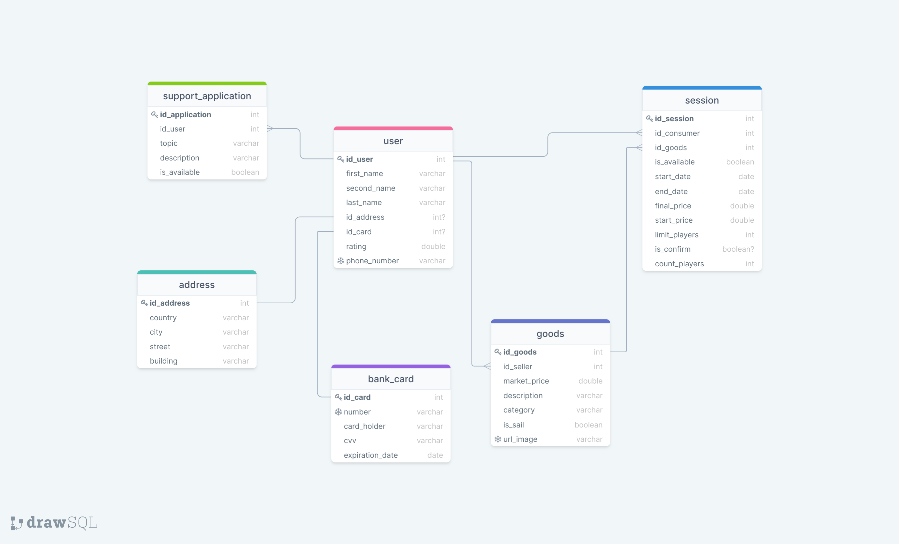

# Курс "Базы данных"

## Задание 1
 
### Cписок функциональных требований для проекта:
* Реализация приложения в виде проекта с Графической частью (Mobile UI) и сервисной частью (Back-end\REST API)
* Возможность регистрации пользователей в приложении
* Возможность авторизации пользователей в приложении
* Возможность восстановления доступа к аккаунту в случае утери пароля и прочего
* Каждый пользователь может являться одновременно и покупателем и продавцом
* Возможность создавать пользователем сессию аукциона в роли Продавца на отдельной странице приложения
* Возможность пользователем учавствовать в аукционе в роли Покупателя
* Возможность поиска аукциона в перечне открытых аукционов
* Отрисовка таймера до закрытия аукциона и имени пользователя, чья ставка наибольшая и значения данной ставки
* Возможность добавить розыгрываемый товар в список "Мои товары" на отдельной странице приложения
* Реализовать меню по добавлению товара("Фото товара", "Рыночная цена товара", "Категория", "Описание")
* Возможность привязки банковской карты к приложению
* По окончании аукциона предоставлять пользователю возможность согласиться\не соглашаться с делкой в отдельной вкладке приложения
* Реализация совершения сделки (перевода средств с карты на карту) через приложение с целью сбора комиссии за сервис
* Реализация меню настроек ацкционой сессии (Лимит участников; Можно ли зайти в сессию после ее начала; Длительность сессии; Вход по приглашениям; Розыгрываемый товар; Минимальная ставка)
* Предусмотреть, что если в розыгрыше не будет розыгран товар, то продавец его может повторно выставить
* Предусмотреть, что если товар был выигран Покупателем, то данный товар замораживается и его нельзя повторно выставить
* Реализация рейтинговой системы (Для понимания надежных продавцов)
* Реализация выбора способа доставки товара покупателем
* История с выигрышными\розыгранными товарами для пользователей
* Предусмотреть, что в случае невозможности оплатить товар покупателем, товар можно повторно выставить
* Возможность сортировать сессии по параметрам (По статусу; По категориям)
* Реализовать механизм тех поддержки с созданием заявок для рассмотрения
* Реализовать определенные требования к совершению сделок (Минимальная цена, Качество товара, Можно ли такое продавать)

### Роли пользователей и действия для каждой роли:
#### Покупатель
* Регистрироваться в приложении
* Авторизовываться в приложении
* Восстанавливать доступ к аккаунту
* Участвовать в аукционе
* Соглашаться \ Не соглашаться с оплатой выигранного товара
* Привязывать банковскую карту
* Просматривать аукционные сессии
* Повышать цену лота в сессии
* Участвовать в сессии
* Оставлять отзыв о покупателе, чей товар был выигран
* Просматривать историю выигранных товаров
* Выбирать способ доставки товара
* Просматривать аккаунты пользователей
* Сортировать аукционные сессии
* Обращаться в техническую поддержку
#### Продавец
* Регистрироваться в приложении
* Авторизовываться в приложении
* Восстанавливать доступ к аккаунту
* Добавлять товар для розыгрыша
* Создавать аукционню сессию
* Настраивать аукционную сессию
* Привязывать банковскую карту
* Ознакамливаться с предпочтительным способом доставки до покупателя товара
* Повторно выставлять ранее выставленный товар в определенных случаях
* Просматривать историю розыгранных товаров
* Просматривать аккаунты пользователей
* Получать прибыль с успешных сделок
* Обращаться в тех поддержку
#### Администратор
* Просматривать аккаунты пользователей
* Блокировать аккаунты пользователей
* Блокировать сессии
* Администрировать заявки технической поддержки
### Объекты, о которых будут храниться данные:
* Пользователь
* Банковская карта
* Адрес
* Сессия
* Товар
* Заявление в техническую поддержку
### Связи между объектами для хранения данных:
* Пользователь имеет банковскую карту
* Пользователь имеет адрес доставки
* Каждая заявка в техническую поддержку имеет своего создателя
* Каждый товар имеет своего продавца
* Каждая ссессия имеет своего покупателя
* Каждая сессия имеет выставленный товар

### Cхема
[Ссылка](https://drawsql.app/hse-8/diagrams/lottery)

