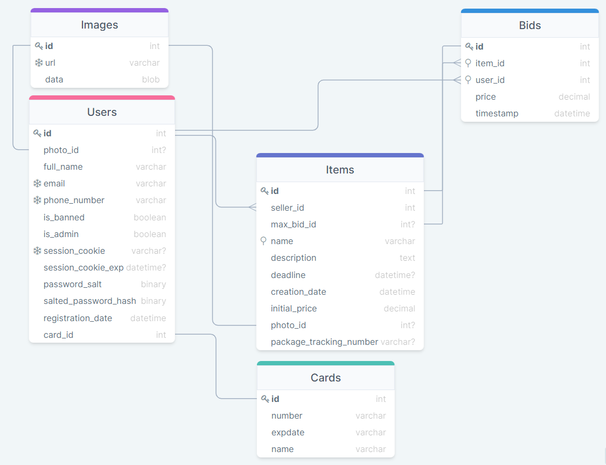

# Задание №1. Борисов Костя БПИ197

---
# Условие
Вам поручено разработать онлайн-аукцион.
Он позволяет продавцам продавать свои товары с помощью аукциона.
Покупатели делают ставки. Выигрывает последняя самая высокая ставка.
После закрытия аукциона победитель оплачивает товар с помощью кредитной карты.
Продавец отвечает за доставку товара покупателю.

* Предложите список функциональных требований для проекта.
* Определите роли пользователей и действия для каждой роли.
* Определите объекты, о которых будут храниться данные.
* Определите связи между объектами для хранения данных.
* Нарисуйте схему объектной модели (используя любые обозначения, которые вам удобны).
---

## Функциональные требования
### Общие для всех пользователей
1. Регистрация пользователей. Для этого им нужно подтвердить email, номер телефона и кредитную карту.
2. Вход пользователей через пароль и/или номер телефона. При этом сохраняется сессия, то есть пароль не надо вводить при каждом действие.
3. Изменение фотографии и имени. При этом система должна поддерживать людей, у которых двойное имя и/или нет отчества.
4. Удаление аккаунта.
5. Возможность быть и покупателем и продавцом.

### Для покупателей
1. Ставить ставки на товары.
2. Отслеживать доставку купленных товаров.
3. Поиск товаров по имени

### Для продавцов
1. Выставлять товары на продажу.

### Для админов
1. Удаление нехороших фоток.
2. Удаление нехороших товаров.
3. Возможность банить других пользователей, которые не админы.

## Объекты
1. Картинка
    1. ID
    2. Ссылка, по которой её можно скачать
    3. Сами данные картинки
2. Пользователь
    1. ID
    2. Полное имя
    3. Фотография, если имеется
    4. Email
    5. Номер телефона
    6. Является ли пользователь администратором?
    7. Забанен ли пользователь?
    8. Кредитная карта
    9. Информация для аутентификации
3. Кредитная карта
    1. ID
    1. Номер
    2. Имя владельца
    3. Срок действия карты \
       (CVC нельзя хранить по закону)
4. Товар
    1. ID
    1. Продавец
    2. Начальная цена
    3. Имя, по которому можно делать поиск
    4. Описание
    5. Фотография
    6. Информация для отслеживания посылки, если товар уже продан
    7. Список ставок
    8. Выигрышная ставка
5. Ставка
    1. ID
    2. Товар
    3. Пользователь, сделавший ставку
    4. Сумма ставки

## Связи между объектами
### Один к многим
1. Пользователь - Ставка
3. Пользователь - Товар
1. Товар - Ставка

### Один к одному
1. Пользователь - Карта
2. Пользователь - Картинка
3. Товар - Картинка

## Диграмма:

[Ссылка на DrawSQL](https://drawsql.app/hse-14/diagrams/auction)

