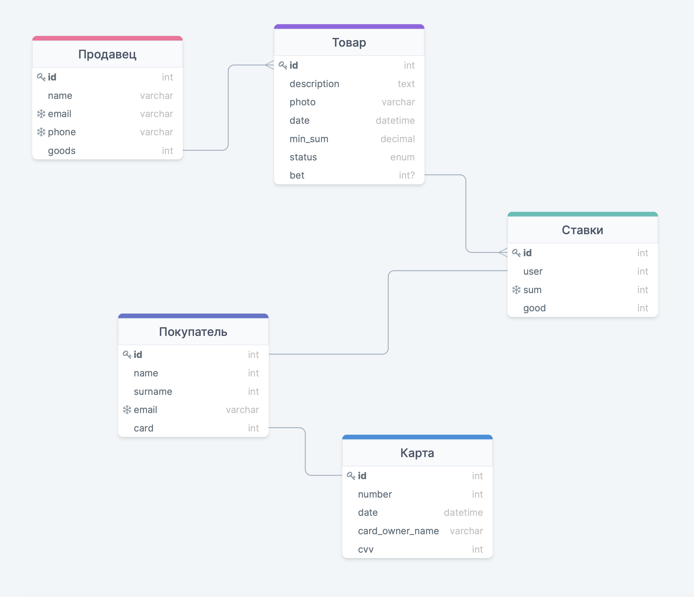

# Задание 1
## Требования
### Требования к возвможностям продавцов
1. Создание аккаунта продавца
- Контактные данные продавца (почта, номер телефона)
- Указание имени продавца
2. Продавец должен иметь возможность добавлять товары, которые он собирается продать
3. Должны отображаться все товары продавца, которые участвовали(вуют) в аукционе
4. Продовец может отменять лот, без указания причины
### Требования к товарам
1. При добавлении нового товара на аукциона продовец должен добавить текстовое описание товара, фотография и минимальную ставку
2. Необходисо сохранять дату добавления товара на аукцион
3. У каждого товара должна быть информация об участии в аукционе (продан / доступен / лот отменен)
### Требования к возможностям покупателя
1. Создание аккаунта покупателя
- Указание фамилии, имени
- Почты
- Адрес, по которому будет доставлен товар
2. Просмотр всех существущие товары на площадке
3. Просмотр списка всех продавцов на площадке
4. Предложение ставки на товар
### Требования к оплате
1. Пользователь должен указать данные карты, с которой будут списаны деньги
2. Когда совершается ставка, необходимо удержать 1 рубль на карте для подтверждения. Если ставка окажется максимальной, то будет списана полная сумма ставки. В противном случае необходимо снять удержание. Делаем по аналогии с оплатой проезда в автобусе.
3. Хранить в зашифрованном виде:
- Номер карты
- Срок действия карты
- Имя держателья карты
- CVV код
### Требования к ставкам
1. Необходимо хранить информацию о пользователе, который сделал ставку
2. Необходимо хранить информацию о товаре, который хотят приобрести
3. Хранение суммы ставки
4. Все значения ставки должны быть уникальны
5. При завершении аукциона удаляется информация о всех ставках
## Роли и действия для каждого
### Администратор
У администратора должен быть доступ ко всем данным, хранящимся в БД. Он может вносить любые ищменения. Единственное, что не доступно это просмотр адреса пользователей, данных о карте
### Продавец
Продавец должен иметь доступ к добавлению новых товаров и изменению статуса с "доступен для покупки" на "лот отменен". Также он должне иметь возможность редактировать любые данные о нем и о его товарах
### Покупатель
Покупатель должен иметь доступ к добавлению новой ставки. Помимо этого он должен иметь возможность редактировать все данные о себе и о способе оплаты
## Объекты
1. Продавец
2. Товар
3. Пользователь
4. Карта
5. Ставка
## Связи объектов
- У продовца хранится ссылка на все его товары. При удалении продавца удаляются и товары
- У каждого покупателя есть одна карта. При удалении покупателя удаляется и его карта
- У каждого товара хранится ссылка на все ставки данного товара. При удалении товара удаляются и ставки
- Для каждого товара должна быть своя таблица со ставками
- У каждого покупателя есть ссылка на его ставки. При удалении покупателя удаляются и все ставки

## Схема
[Ссылка на диаграмму](https://drawsql.app/hse-7/diagrams/1xhsebet)

