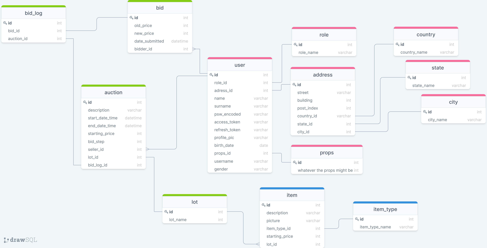

# Пике Кирилл задание 1

## Предложить список фунционала

Приложение должно предоставлять пользователю возможность:
- регистрации и авторизации
- составления описания товара с кратким описанием, фотографией и начальной стоимостью
- составления лота с товаром(ами) для аукциона
- составления описания нового аукциона с датой и временем начала, лотом
- доступ к информации о прошедших и запланированных аукционах
- возможность сортировки информации о прошежших и запланированных аукционах
- возможность поиска лотов по параметрам
- возможность отменять аукцион до его начала или если никто не успел сделать ставку
- возможность зарегистрироваться на аукцион
- возможность оплаты выигранного лота через сторонние сервисы
- возможность получения платы за проданный лот по предоставленным реквизитам
- возможность получения обратной связи от поддержки

## Определить роли пользователей и действия для каждой роли

Должны быть следующте роли пользователей:
- продавец: пользователь, который имеет возможность составлять лот для проведения аукциона
- покупать: пользовательЮ который имеет возможность делать ставки на лот
- администратор: пользователь, который имеет возмжность следить за легитимностью аукционов, назначать модераторов
- модератор: пользователь, который имеет возможность блокировать аккаунты пользователей, следить за легитимностью аукционов
- поддержка: пользователь, который имеет возмжность рассматривать жалобы других пользователей

**Продавец** должен иметь возможность:
- авторизироваться в приложение
- задавать описание объекта для выставления на аукцион
- составлять лот из объектов
- задавать описание аукциона
- отменять аукцион до его начала или если никто не успел сделать ставку
- предоставлять реквизиты счета для получения средств за аукцион
- взаимодействовать с другими пользователями и поддержкой

**Покупать** должен иметь возможность:
- авторизироваться в приложение
- получать информацию о прошедших и запланированных аукционах
- находить/фильтровать аукциона по параметрам
- регистрироваться на аукцион
- следить за текущей информацией ацкиона во время его проведения
- делать ставку на аукционе
- производить оплату кредитной картой через сторонние червисы
- взаимодействовать с другими пользователями и поддержкой

**Администратор** должен иметь возможность:
- авторизироваться в приложение
- создавать аккаунты для модераторов и поддержки
- отменять аукцион до его начала или если никто не успел сделать ставки
- аннулировать ставку при возникновении нарушений
- блокировать пользовательский аккаунт
- взаимодействовать с другими пользователями и поддержкой

**Модератор** должен иметь возможность:
- авторизироваться в приложение
- отменять аукцион до его начала или если никто не успел сделать ставки
- отменять ставку пользователя
- блокировать пользователльский аккаунт 
- взаимодействовать с другими пользователями и поддержкой

**Член поддержки** должен иметь возможность:
- авторизироваться в приложение
- взаимодействовать с пользователями
- блокировать и разблокировывать аккаунты
- отменять аукционы

## Список объектов о которых буду храниться данные

    - пользователь
    - роль
    - товар
    - лот
    - адресс
    - ставка
    - лог ставок
    - реквизиты
    - лот
    - аукцион
    
    
    
## Связи между объектами

| А  | В  | типа связи  |
|---|---|---|
| пользователь  | роль  |один ко многим   |
|пользоваель   |лот   |один ко многим   |
|пользователь   |реквизиты   | один к одному   |
| пользователь   |ставка   |один ко многим   |
|пользователь   |аукцион   |один ко многим   |
|лот   |товар   |один ко многим   |
|адресс   |страна/город/штат   |один к одному   |
|лог ставок   |ставка   |один к одному   |
|лог ставок   |аукцион   |один к одному   |
|аукцион   |лот   |один к одиному   |
|лот   |товар   |один ко многим   |
|лот   |товар   |один ко многим   |
|товар   |тип товара   |один к одному   |

## Таблица 
