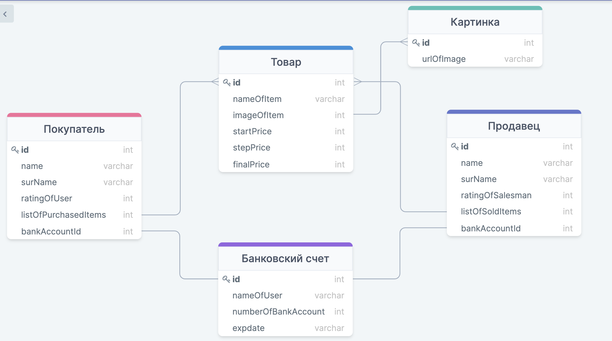

# Функциональные требования

 ## 1. Для покупателя:
    1) Создавать аккаунт 
    2) Авторизироваться
    3) Привязывать банковскую карту/счет к аккаунту
    4) Просматривать активные для продажи лоты
    5) Находить лоты с необходимым товаром по его названию
    6) Сортировать лоты по цене
    7) Делать стартовую ставку в размере н-ой суммы денег
    8) Повышать ставку
    9) Отслеживать активные для текущего покупателя лоты
    10) Оплачивать товар с счета/банковской карты
    11) Заказывать доставку

 ## 2. Для продавца:
    1) Создавать аккаунт 
    2) Авторизироваться
    3) Привязывать банковскую карту/счет к аккаунту
    4) Публиковать объявление с новым лотом
    5) Указывать стартовую цену товара
    6) Указывать временные ограничения по продаже лота
    7) Добавлять описание к продоваемому товару
    8) Изменять информацию о лоте
    9) Удалять объявление после продажи или по желанию
    10) Выставлять товар повторно с другими характеристиками продажи
    11) Получать деньги за продажу на счет/карту
    12) Осуществлять доставку  
 
## 3. Для платформы онлайн-аукциона:
    1) Определять победителя у конкретного лота
    2) Хранить активные аукционы
    3) Выставлять необходимые требования к  покупателям, продавцам и лотам
    4) Верифицировать пользователей при регистрации по документам
    5) Сохранять историю аукциона (все прошедшие объявление)
    6) Отслеживать доставку товара 
    7) Выступать гарантом между продавцом и покупателем
    8) Удалять лоты, нарушающие требования площадки
    9) Осуществлять тех-поддержку пользователей

 # Действия для каждой роли

 ## 1. Покупатель:
    1) Зарегистрироваться
    2) Авторизоваться
    3) Привязать счет к аккаунту
    4) Получить товары по названию
    5) Получить список всех товаров
    6) Сортировать товары по цене
    8) Сделать первую ставку на товар
    9) Повысить ставку на товар
    10) Смотреть на активные лоты
    11) Оплатить покупку с банковского счета 
    12) Указать необходимость в доставке
    13) Указать адрес 
    14) Следить за изменениями статуса доставки 
   
 ## 2. Продавец:
    1) Зарегистрироваться
    2) Авторизоваться
    3) Привязать банковскую карту/счет
    4) Опубликовать новое объявление с товаром
    5) Указать стартовую цену, временные ограничения и информацию по лоту
    6) Корректировать информацию по лоту
    7) Удалить лот
    8) Выставить повторно товар на другие временные рамки 
    9) Получить деньги за продажу товара
    10) Осуществить доставку товара до покупателя при помощи службы доставки

 # Объекты, в которых хранятся данные
 
  ### 1. Покупатель
  ### 2. Продавец
  ### 3. Банковская карта
  ### 4. Товар
  ### 5. Картинка товара

 # Связи объектов
 
 * Продавец и покупатель имеют ссылку на банковскую карту/счет
 * Покупатель имеет таблицу активных лотов 
 * Продавец имеет список продоваемых товаров

