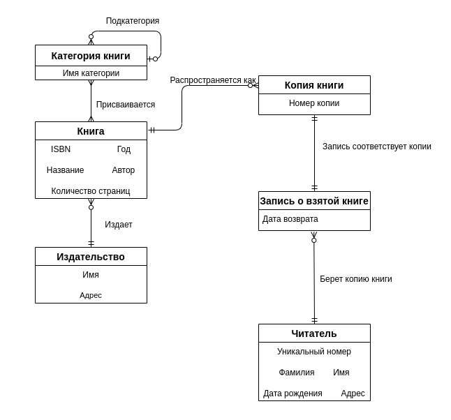
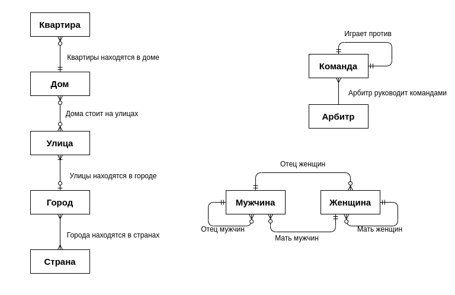
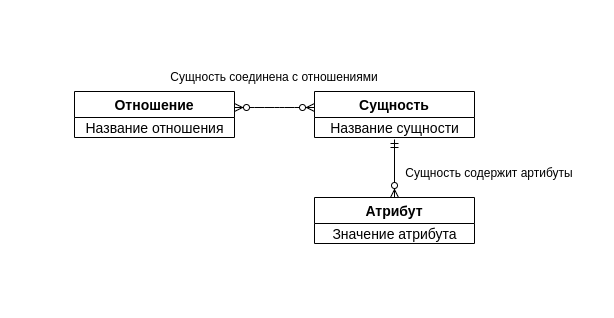

# Задание 2: Агроскин Александр, БПИ197

# №1:

# №2:
(Считаю, что квартира может принадлежать только одному дому, дом может находиться на нескольких улицах, улица находится в конкретном городе, а город может быть в нескольких странах (такие есть!))

# №3:

##P.S
Скорее всего налажал где-то с кардинальностями/концами отношений, простите.
