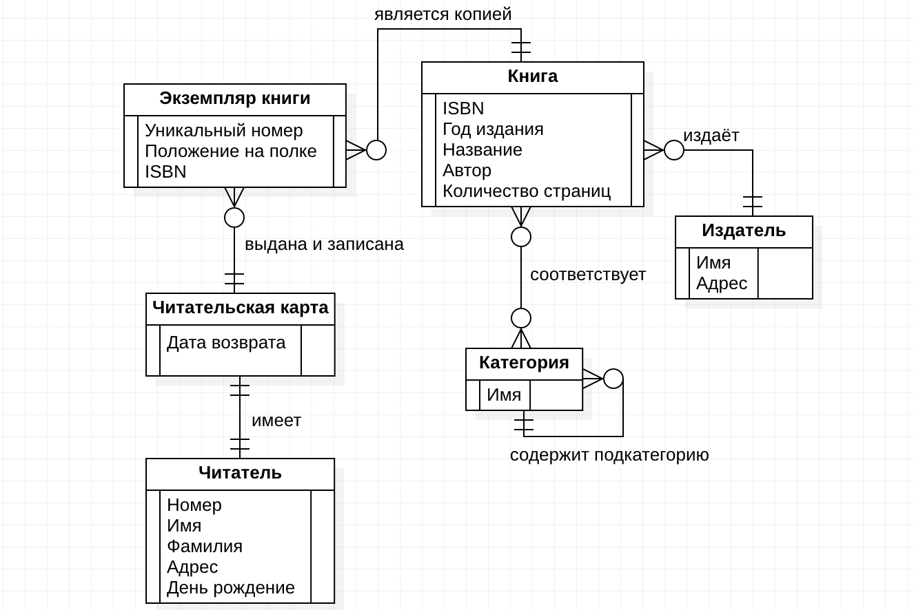
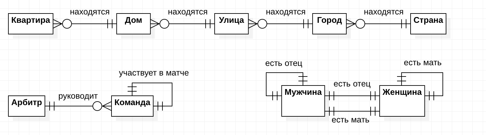
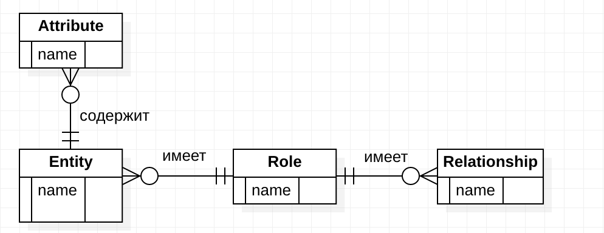

# Задание 2: Ткаченко Никита, БПИ197
 ## Задача 1. Нарисуйте E/R диаграмму для библиотечной системы
 

 ## Задача 2. Смоделируйте следующие отношения в E/R
 

 ## Задача 3. Смоделируйте E/R-модель в виде E/R диаграммы
 
