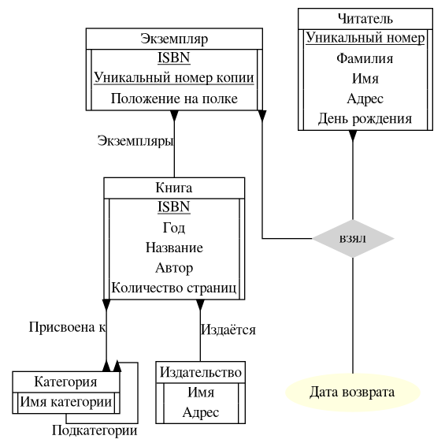
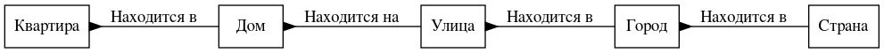
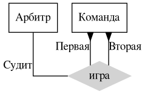
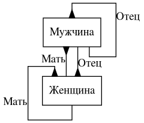
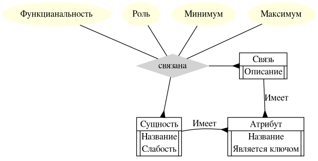

# Задание №2. Борисов Костя БПИ197

## Задача 1.
Нарисуйте E/R диаграмму для библиотечной системы на основе требований.

## Задача 2.
Смоделируйте следующие отношения в E/R.
1. Квартира расположена в доме на улице в городе в стране \

1. Две команды играют друг против друга в футбол под руководством арбитра \

1. У каждого человека (мужчины и женщины) есть отец и мать \

## Задача 3.
Смоделируйте E/R-модель в виде E/R диаграммы.

