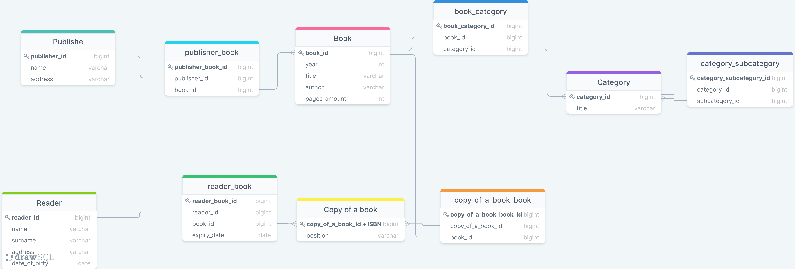
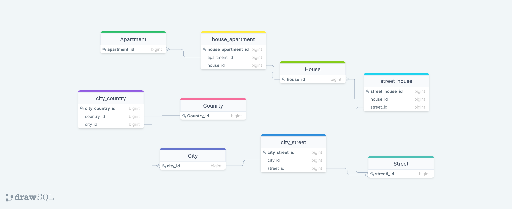
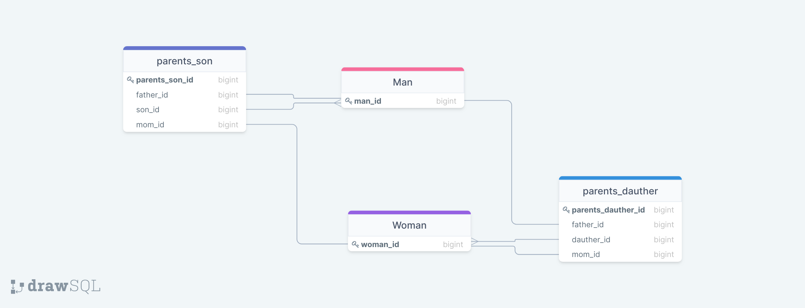
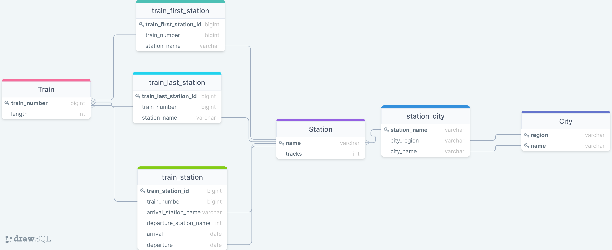
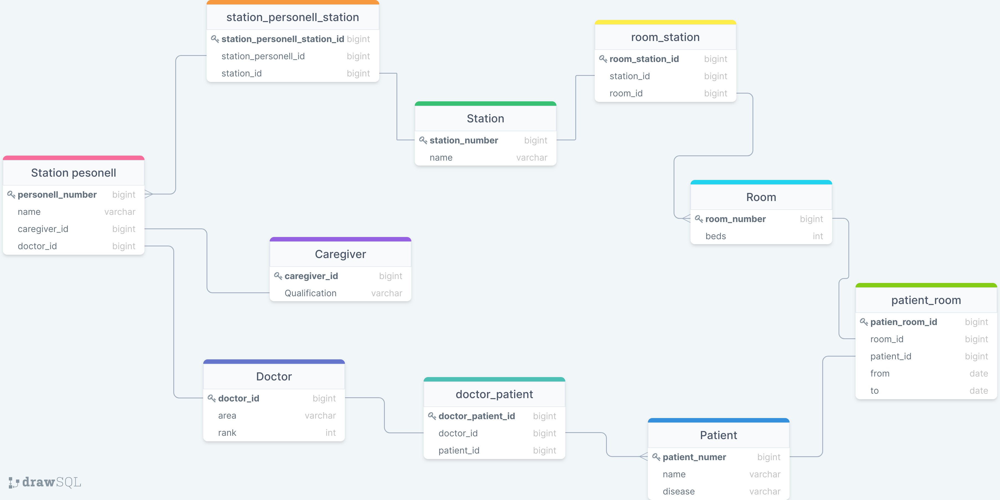

### **_Задание 1_**
Отношение должно связывать объекты. Если оно будет связывать их без упоминания уникальных данных таких как ключи - нарушится определенность. Поэтому должен присутствовать как миниимум один ключ.

### **_Задание 2 (без последней схемы - не сделал)_**

### **_Задание 3.1_**

### **_Задание 3.2_**

### **_Картинка для привлечения внимания_**
